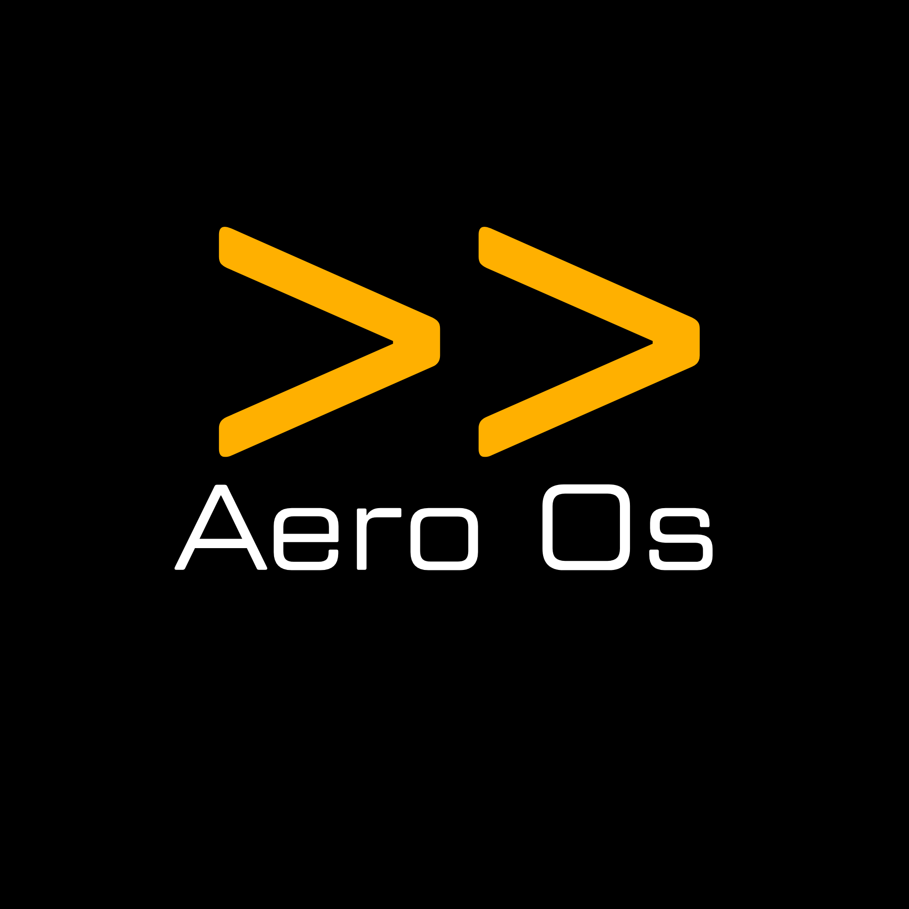
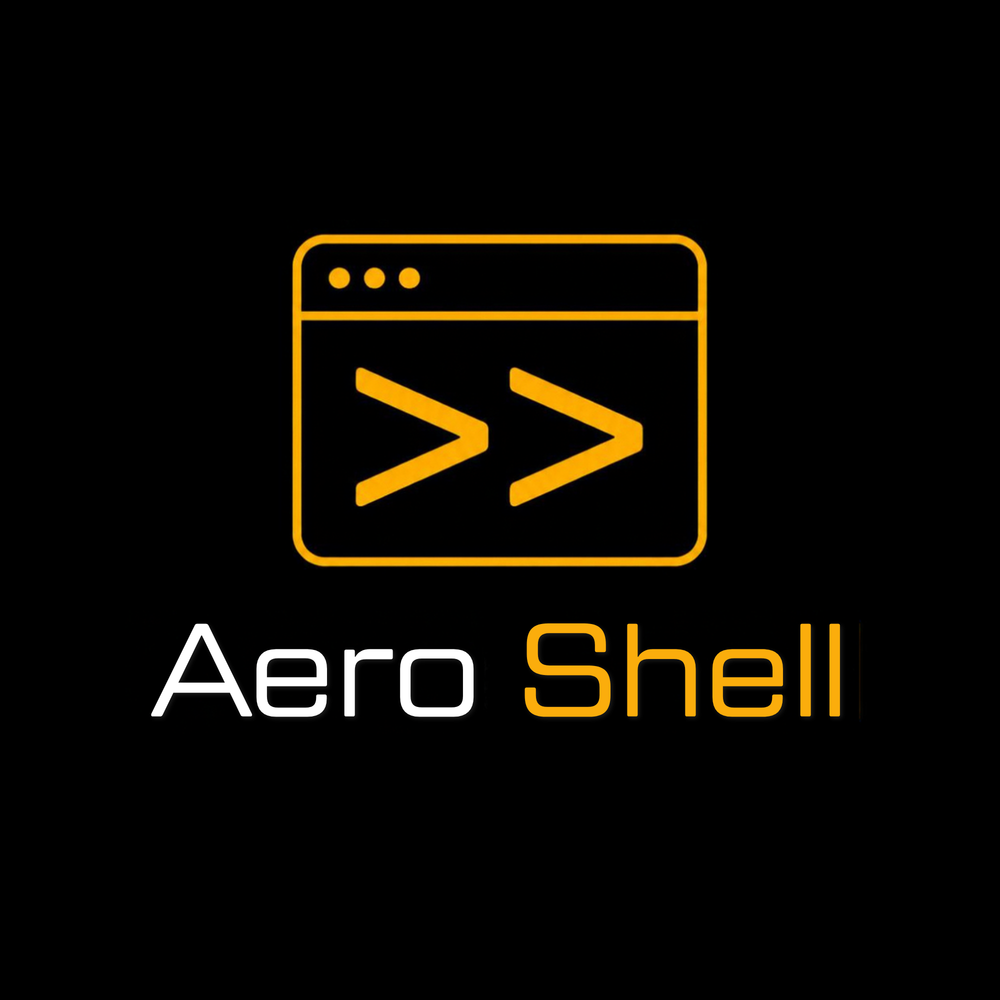

# Aero OS

> Fast. Minimal. Yours.

Aero OS is a minimalist, fast, keyboard-oriented operating system built on top of Arch Linux.

The central idea is simple:

> If Linux can do it, Aero should provide a fast way to do it through the Aero Shell.

Aero is intended to become a complete ecosystem rather than simply an Arch Linux installation with a custom theme.

## Project status

**Early development / pre-alpha**

Aero OS is currently in the foundation stage. The project is being built incrementally, with the first goal being a real, bootable Aero prototype that can be developed and tested in a virtual machine.

Nothing in this repository should currently be considered production-ready.

## Branding

The Aero branding assets are stored centrally in:

`assets/branding/logos/`

The three logo variants have defined roles:

| Asset | Intended use |
|---|---|
| `aero-logo-1.png` | **Taskbar logo** — Aero's taskbar / launcher / application identity |
| `aero-logo-2.png` | **Normal logo** — general Aero OS branding, boot screen, desktop, installer and documentation |
| `aero-logo-3.png` | **Shell logo** — Aero Shell and shell-focused interfaces |

### Taskbar logo

<p align="center">
  
</p>

Used for the **Aero taskbar, launcher and application identity**.

### Normal logo

<p align="center">
  
</p>

Used as the **standard Aero OS logo** throughout the operating system.

### Shell logo

<p align="center">
  
</p>

Used specifically for the **Aero Shell and shell-focused interfaces**.

These files are the project's original uploaded logo assets. Their roles should remain consistent across the Aero ecosystem.

## Core principles

- **Shell first** — the Aero Shell is the central working environment.
- **Fast** — avoid unnecessary services, animations and resource usage.
- **Keyboard oriented** — common tasks should be fast without a mouse.
- **GUI when useful** — graphical applications remain fully usable.
- **Arch based** — Aero uses Arch Linux as its base.
- **Open and free** — the project is intended to remain usable and developable with free/open-source tooling and infrastructure wherever practical.
- **Modular** — Aero components should be independently versioned and maintainable.
- **Recoverable** — Aero Rescue is intended to provide an independent recovery environment for serious system problems.

## Planned ecosystem

### Aero Shell

The central Aero environment, based on Zsh and extended with Aero-specific commands.

Planned capabilities include:

- intelligent completion
- syntax highlighting
- command history
- aliases
- file management
- system administration
- package management
- programming workflows
- Git
- Python
- networking
- media
- web access
- email
- downloads
- search
- Aero-specific commands

Examples:

```bash
search "Arch Linux"
web https://example.com
mail
download https://example.com/file.zip
```

### Aero HUD

A lightweight shell HUD that can appear above the running system.

The planned default shortcut is:

```text
F12
```

The HUD should allow users to access the Aero Shell quickly without making the graphical desktop the center of the operating system.

### Aero Desktop

A minimal graphical environment designed around:

- black / deep-dark visuals
- amber accents
- keyboard control
- touch support
- low resource usage
- restrained animations
- subtle transparency

The desktop is an additional way to work with Aero, not a replacement for the shell.

### Aero Browser

A dedicated browser application with an Aero interface.

Planned features include:

- tabs
- windows
- history
- bookmarks
- downloads
- password management
- search engine selection
- keyboard control
- touch control

Aero will use an existing free/open-source browser engine rather than implementing a complete browser rendering engine from scratch.

### Aero Private

A separate private browsing environment focused on local privacy.

Planned features include:

- no persistent history
- temporary cookies
- temporary website data
- private tabs
- automatic cleanup
- optional automatic deletion
- session deletion when the private browser closes

Aero Private is intended to improve local privacy. It is not intended to bypass network monitoring or external controls.

### Aero Search

A search interface available from both the graphical environment and Aero Shell.

Long-term plans include an independent index and ranking system, while allowing users to select other search providers.

Possible providers include:

- Aero Search
- Google
- DuckDuckGo
- Bing
- Brave Search
- custom search URL

### Aero Rescue

An integrated emergency and recovery environment.

Planned capabilities include:

- system diagnostics
- filesystem checks and repair
- package repair
- configuration repair
- bootloader repair
- log inspection
- malware checks
- file backup
- network recovery
- Aero reset
- disk and partition inspection

Planned commands:

```bash
aero rescue -on
aero rescue -full
```

`aero rescue -on` is intended to open a rescue console while the normal Aero system remains available.

`aero rescue -full` is intended to reboot directly into an independent Aero Rescue environment.

### Aero Studio

A future development environment for the Aero ecosystem.

Planned functionality:

- code editor
- project management
- terminal
- Git
- build system
- package building
- debugging
- Aero SDK
- project templates
- documentation
- release creation

### Aero Update

Aero is designed around a single update workflow.

The normal Arch command remains available:

```bash
sudo pacman -Syu
```

Aero will additionally provide:

```bash
aero update
```

The goal is that users do not need to perform two separate update operations for Arch and Aero.

Aero updates should also be able to provide an appropriate "What's New" page for updated Aero components. Arch-only updates should not trigger Aero release notes.

### Aero Repository

Aero will maintain its own package repository for Aero components, using free infrastructure such as GitHub during the initial development stages.

Planned packages include:

```text
aero-shell
aero-rescue
aero-browser
aero-private
aero-search
aero-studio
aero-desktop
```

### Aero ISO

Aero will eventually provide a bootable ISO built with Archiso.

Planned development flow:

```text
Aero development
        ↓
VM testing
        ↓
Aero configuration
        ↓
Package builds
        ↓
Archiso
        ↓
Aero ISO
        ↓
USB / Live system
        ↓
Installation
```

The ISO must be tested in a fresh virtual machine before a release is considered ready.

## Versioning

Aero has its own version number, independent of the Arch Linux rolling base.

Example:

```text
AERO OS       1.2.0
Aero Shell    1.4.0
Aero Browser  1.3.0
Aero Private  1.1.0
Aero Rescue   1.2.0
Aero Studio   1.0.0
Arch Base     Rolling
```

An Arch Linux update does not automatically change the Aero version.

## Design

Aero's visual identity is based on:

- OLED deep dark: `#000000`
- amber accent
- monospace typography
- technical, uncluttered interfaces
- subtle transparency
- minimal animation

The `>>` Aero symbol is intended to be a central visual identifier, especially for application and taskbar icons.

## Development

Aero is being developed primarily in a Linux virtual machine during the early stages.

A Windows shared folder may be used as a temporary file-transfer mechanism between the Windows host and the development VM.

**The Windows shared folder is not part of Aero OS and is never intended to be included in the final Aero ISO or installed system.**

The actual Aero source tree, build system, configuration and release artifacts belong to the Linux development environment and Git repository.

## Development order

The project is intentionally being built in stages.

### Phase 1 — Foundation

- Arch Linux base
- Aero base
- Aero Shell
- Aero design
- Aero versioning

### Phase 2 — Interface

- Wayland
- Aero Desktop
- Aero HUD
- F12 shell access

### Phase 3 — System

- Aero Rescue
- Aero Boot
- Aero Update
- Aero Repository

### Phase 4 — Applications

- Aero Browser
- Aero Private
- Aero Search
- Aero Studio

### Phase 5 — Distribution

- Archiso
- Aero ISO
- live system
- installer
- release process

## Repository structure

The repository will evolve as development progresses. The intended structure will be modular rather than placing the entire operating system into a single script or application.

A future structure may look similar to:

```text
aeron-os/
├── aero-shell/
├── aero-desktop/
├── aero-hud/
├── aero-rescue/
├── aero-browser/
├── aero-private/
├── aero-search/
├── aero-studio/
├── packages/
├── iso/
├── docs/
├── assets/
│   └── branding/
│       └── logos/
├── README.md
└── LICENSE
```

This structure is a target for the project and does not imply that all components already exist.

## Backups and releases

Important working states should be committed and tagged in Git before major changes.

Example:

```text
v0.1.0
v0.2.0
v0.3.0
...
v1.0.0
```

This makes it possible to return to a known working state during development.

## License

Aero OS is released under the MIT License. See [LICENSE](LICENSE).

## Project repository

https://github.com/LordLOLQDH/aeron-os
